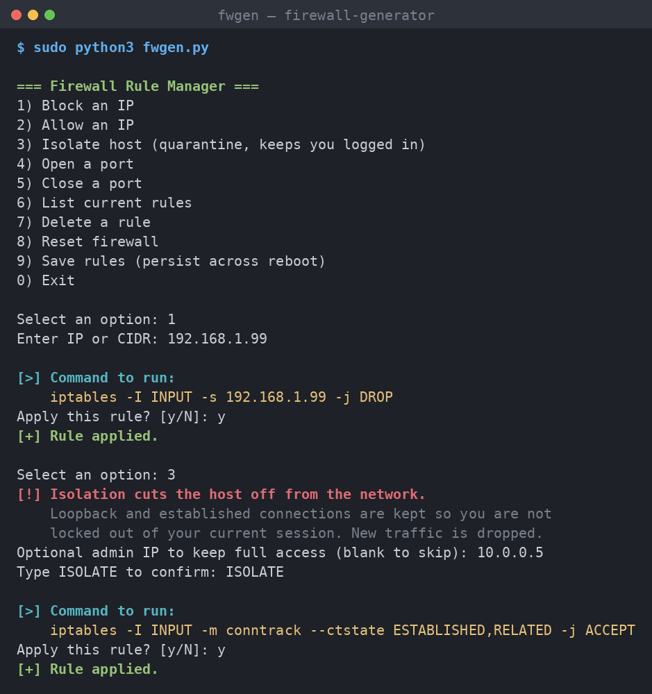

# 🔥 fwgen — Simple Firewall Rule Manager

> An interactive, menu-driven front-end for Linux `iptables` / `ip6tables`.
> Add, block, allow, isolate, and reset firewall rules — with validated input
> and a **preview + confirm** step before anything touches your firewall.

<p align="center">
  
  
  
  
</p>

---

> ⚠️ **For educational and authorized use only.** Firewall changes can lock you
> out of a machine. Run it in a VM or lab first, and only on systems you own or
> are authorized to manage.

## ✨ Features

- 🧭 **Plain numbered menu** — no dependencies, pure Python 3 standard library.
- ✅ **Validated input** — IPs/CIDRs checked with `ipaddress`, ports limited to 1–65535.
- 🌐 **IPv4 & IPv6** — IPv6 addresses are automatically routed to `ip6tables`.
- 👀 **Preview + confirm** — every action prints the exact command and asks before running it.
- 🔒 **Lockout-safe isolation** — quarantine keeps loopback, established
  connections, and an optional admin IP, so you don't drop your own SSH session.
- 🎯 **Correct rule precedence** — block rules use `-I` (insert at top) so they
  actually take effect over existing ACCEPT rules.
- ♻️ **Two reset modes** — *safe* (default DROP, keep loopback/established) or *open*.
- 💾 **Persist rules** — save to `/etc/iptables/rules.v4` so they survive a reboot.
- 🛡️ **Guardrails** — root check, and typed-keyword confirmation for disruptive actions.

## 📸 Demo

<p align="center">
  
</p>

<details>
<summary>Text version of the session above</summary>

```text
=== Firewall Rule Manager ===
1) Block an IP
2) Allow an IP
3) Isolate host (quarantine, keeps you logged in)
4) Open a port
5) Close a port
6) List current rules
7) Delete a rule
8) Reset firewall
9) Save rules (persist across reboot)
0) Exit

Select an option: 1
Enter IP or CIDR: 192.168.1.99

[>] Command to run:
    iptables -I INPUT -s 192.168.1.99 -j DROP
Apply this rule? [y/N]: y
[+] Rule applied.
```

</details>

## 🚀 Quick start

```bash
git clone https://github.com/SysFr4m3r/firewall-generator.git
cd firewall-generator
sudo python3 fwgen.py
```

Then pick a number and follow the prompts. To explore safely, start with
option **6 (List current rules)** — it's read-only and changes nothing.

## 🧩 Actions

| # | Action | Rule generated |
|---|--------|----------------|
| 1 | Block an IP | `-I INPUT -s <ip> -j DROP` (uses `ip6tables` for IPv6) |
| 2 | Allow an IP | `-I INPUT -s <ip> -j ACCEPT` |
| 3 | Isolate host | keep `lo` + established (+ optional admin IP), then policy `DROP` |
| 4 | Open a port | `-A INPUT -p <proto> --dport <port> -j ACCEPT` |
| 5 | Close a port | `-I INPUT -p <proto> --dport <port> -j DROP` |
| 6 | List rules | `-L INPUT -n --line-numbers` (IPv4 or IPv6) |
| 7 | Delete a rule | `-D <chain> <line#>` |
| 8 | Reset firewall | *safe* (DROP + keep lo/established) or *open* (ACCEPT) |
| 9 | Save rules | `iptables-save > /etc/iptables/rules.v4` |

## 🔐 Security & design notes

This started as a learning project, so the design choices are deliberate:

- **No shell injection surface** — commands are executed as argument *lists*
  via `subprocess.run([...])`, never with `shell=True`, and all user input is
  validated before use.
- **Preview before apply** — nothing runs until you confirm, so you always see
  the exact rule first.
- **Lockout-aware** — isolation and safe-reset preserve loopback and established
  connections instead of blindly dropping everything.

### Limitations

- Isolation and port rules set **IPv4** policy. Per-IP block/allow is dual-stack,
  but full IPv6 isolation would need extending `isolate_host()`.
- Rules aren't persisted automatically — use option **9** to save them.

## 📋 Requirements

- Python 3 (standard library only — no `pip install` needed)
- `iptables` / `ip6tables`
- root / `sudo`

## 🗺️ Roadmap

- [ ] Full dual-stack (IPv6) isolation and reset
- [ ] `nftables` backend option
- [ ] Log every rule the tool creates
- [ ] Named rule profiles (e.g. "web server", "lockdown")

## 🤝 Contributing

Issues and pull requests are welcome. This is a learning-focused project, so
clear explanations in PRs are appreciated.

## 📄 License

Released under the [MIT License](LICENSE).
